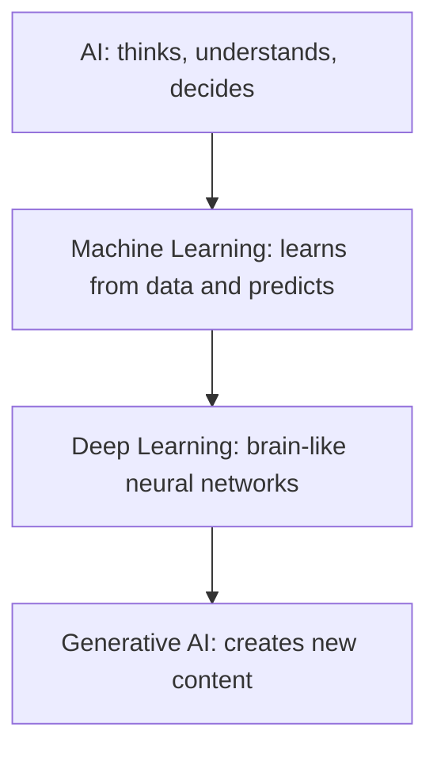
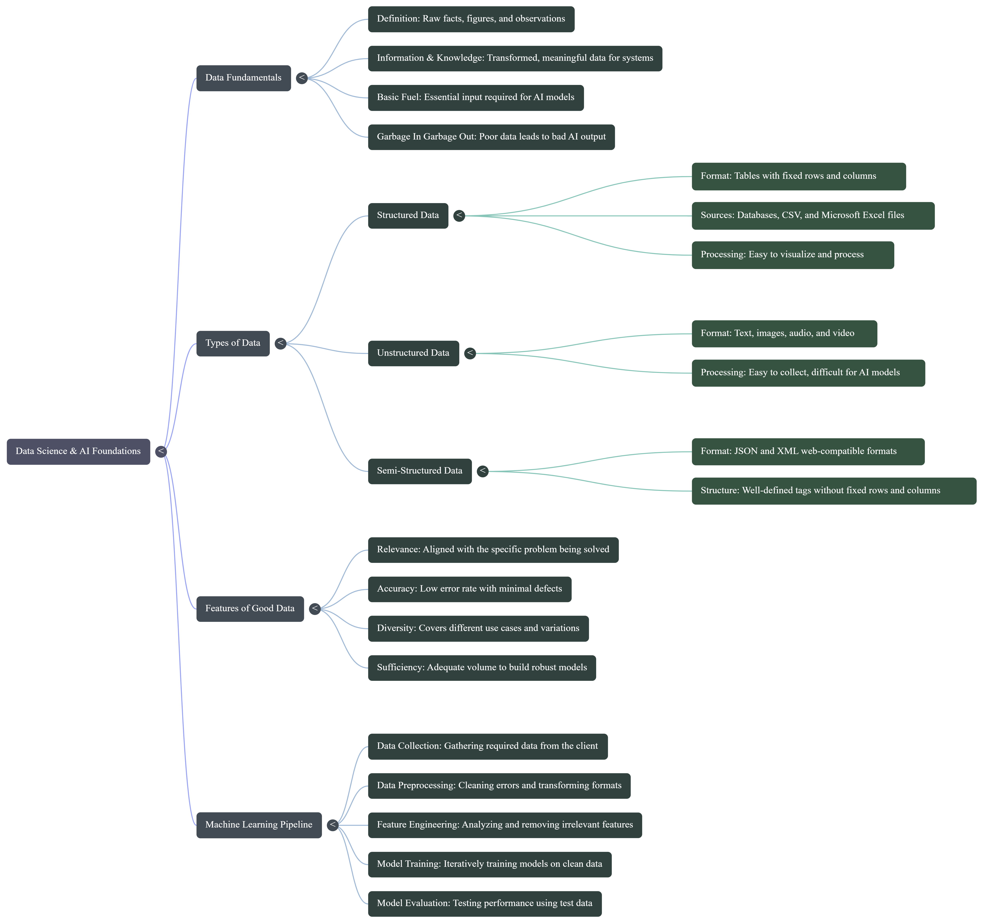

# 🤖 AI Stuffs

## 💡 10.1 The Early Idea

Early researchers saw that a calculator beats us at arithmetic. So they asked: if a machine can calculate, can it also learn and think?

## 🧬 10.2 The Result: AI Today

That question took decades to answer. Now it's in your pocket:

- **Siri / Google Assistant**: say "Call Ahmed" and it dials. (Siri launched in 2011.)
- **Face unlock**: your phone knows it's you.
- **YouTube and Netflix**: they predict what you'll want to watch next.
- **Self-driving cars**: the car does the driving.
- **ChatGPT**: you talk, it answers.

## 📅 10.3 Timeline

| Period | Event |
| --- | --- |
| **1948** | Alan Turing and David Champernowne design **Turochamp**, a chess algorithm run by hand on paper (no computer could run it) |
| **1950** | Turing publishes *"Computing Machinery and Intelligence"*, asking "Can machines think?" and proposing the Turing Test. This is the usual conceptual starting point of AI |
| **1951** | **Dietrich Prinz** (a colleague inspired by Turing) runs the first limited chess program on the Ferranti Mark 1. It could only solve "mate-in-two" puzzles, not play a full game |
| **1956** | The term **"artificial intelligence"** is coined by John McCarthy; the Dartmouth workshop makes AI a formal field |
| **1958** | **Perceptron**, an early learning neural network, is introduced |
| **1960s** | **ELIZA**, an early chatbot by Joseph Weizenbaum at MIT (developed 1964-66, published 1966). It matched keywords against scripted rules, so it was rule-based, not like ChatGPT |
| **1950s to 1970s** | Mostly research and experiments, with some early expert systems |
| **1974-1980** | First **AI winter**: funding and interest drop |
| **1980s** | **Expert systems** (rule-based programs that capture human experts' knowledge, e.g. XCON for configuring computers) are adopted by companies. AI starts to be used **commercially** |
| **1986** | Hinton and colleagues popularise **backpropagation**, the training method behind most modern AI |
| **1987-1994** | Second **AI winter** |
| **1997** | IBM **Deep Blue** beats chess champion Garry Kasparov |
| **2011** | **Siri** launches on the iPhone 4S (October) |
| **2012** | **AlexNet** wins ImageNet by a large margin and starts the deep learning era |
| **2016** | **AlphaGo** (reinforcement learning) beats Go champion Lee Sedol |
| **2017** | Google publishes the **Transformer** ("Attention Is All You Need") |
| **2018-2020** | **GPT** and **BERT**, then GPT-3: large language models appear |
| **2022** | **ChatGPT** launches (30 Nov) and brings generative AI to the public |
| **2023 onward** | Multimodal models (text, image, audio, video) and **AI agents** spread |

```text
1950    1956    1966    1980s     1997    2012      2017         2022
 │       │       │       │         │       │         │            │
Turing  "AI"   ELIZA   Expert    Deep    AlexNet  Transformer  ChatGPT
Test   coined          systems   Blue
                  ╰─ winters: 1974-1980 and 1987-1994 ─╯
```

## 📦 AI as a Service

- **SaaS** – Software over the internet, no install needed.
- **RaaS** – Get results as a service (AI-driven outputs).

---

## ⚙️ Hardware for AI

- **TPU (Tensor Processing Unit)** – AI-specialized hardware.
- **GPU (Graphics Processing Unit)** – Parallel task execution.
- **CPU (Central Processing Unit)** – Serial task execution, precise.

---

## 📖 1. Core AI Terms

- **Machine Programming** – Machine follows explicit instructions.
- **Machine Learning (ML)** – Machines learn from data/examples.
- **Deep Learning (DL)** – Easier ML using neural networks.
- **NLP (Natural Language Processing)** – Understanding human language.
- **Transformer** – Neural network design (2017) behind modern LLMs.
- **LLM (Large Language Model)** – Huge language model trained on massive text (e.g., ChatGPT).
- **Autonomous AI** – Acts without human help (e.g., self-driving cars).
- **AI Agent** – AI that plans and takes actions toward a goal using tools.

## 🏷️ 2. Types of AI

- **ANI** – Narrow, task-specific intelligence.
- **AGI** – Human-level general intelligence.
- **ASI** – Superintelligence (future concept).

```text
ANI  ──────────►  AGI  ──────────►  ASI
(today)         (not yet)         (future concept)
 one task      any human task    beyond humans
```

## 🔗 3. How the Terms Relate



```text
┌──────────────────────────────────────────┐
│ AI                                       │
│  ┌────────────────────────────────────┐  │
│  │ Machine Learning                   │  │
│  │  ┌──────────────────────────────┐  │  │
│  │  │ Deep Learning                │  │  │
│  │  │  ┌────────────────────────┐  │  │  │
│  │  │  │ Generative AI          │  │  │  │
│  │  │  └────────────────────────┘  │  │  │
│  │  └──────────────────────────────┘  │  │
│  └────────────────────────────────────┘  │
└──────────────────────────────────────────┘
```

### 👨‍👩‍👧‍👦 3.1 Family Story

- **AI 👪** = the parents
- **Machine Learning 🎓** = the student who learns from data
- **Deep Learning 🧠** = the genius child who understands things deeply on their own
- **Generative AI 🎨** = the artist child who creates new things (text, pictures, video, audio)

## 📊 4. Data Science

- **Data collection 📥:** gather raw data from real-world sources
- **Data cleaning 🧹:** fix and prepare data before using AI
- **Basic analytics 🔍:** understand the data
- **Visualization 📊:** show data as charts/graphs
- **Patterns & trends 📈:** extract insights from data

```text
Collect ──► Clean ──► Analyse ──► Visualise ──► Insights
```



## 🤖 5. Machine Learning

**Machine Learning (ML):** give a computer lots of data and let it **learn from examples**, like a student who learns by seeing examples.

Three main types (there are others, but these are the main ones):

| Type | Data | Goal | Analogy |
| --- | --- | --- | --- |
| Supervised | Labelled | Predict / classify | Teacher |
| Unsupervised | Unlabelled | Find groups | No teacher |
| Reinforcement | Feedback only | Maximise reward | Reward and punishment |

### 🧑‍🏫 5.1 Supervised Learning ("learning with a teacher")

- Data has labels (input + correct output)
- **Prediction (regression):** predict a quantity
- **Classification:** sort objects into categories

Example: show 10 pictures of apples and tell it "these are apples". Later it recognises a new apple because it is red and round.

### 🕵️ 5.2 Unsupervised Learning ("learning without a teacher")

- Data has no labels (only input)
- **Clustering:** machine groups similar data itself

Example: 100 people, and nobody says which group each belongs to. The computer groups them (same age, same shopping habits, same city).

### 🎮 5.3 Reinforcement Learning ("reward and punishment")

- The computer does an action. **Correct -> reward. Wrong -> punishment.** Over time it learns to repeat what earns rewards.
- Machine tries outputs and is told only whether they are right or wrong
- Sits between supervised and unsupervised learning

```text
        action
Agent ───────────► Environment
  ▲                    │
  └──── reward ◄───────┘
        (or punishment)
```

## 🧠 6. Deep Learning (advanced form of ML)

- A **special, more advanced type of Machine Learning**.
- Inspired by the human brain, it uses a **neural network**.
- **Neural networks:** connected neurons simulated in a machine
- Used for images, speech, and language
- Recognizes faces, voices, and human emotions
- **ML:** humans tell the computer the rules ("this is an apple, this is a banana").
- **Deep Learning:** the computer **makes the rules itself**, without being told. Give it 1000 fruit photos and it learns which is an apple and which is a banana.
- (Simplification: a network always has an input layer and an output layer, with **one or more** hidden layers between. "Deep" means many hidden layers.)

Example: show it someone's photo and other faces. It analyses eyes, nose and face shape, and later recognises her in a new photo. Face unlock and self-driving cars use deep learning.

### 🕸️ 6.1 Neural Network Layers

```text
Input Layer  ->  Hidden Layer(s)  ->  Output Layer
(data goes in)   (analysis happens)   (result comes out)
```

> 💡 **AI Task/Prompt Equivalent:** *"Analyze these input images based on their visual features and classify them as an Apple or a Banana."*

```text
 Input          Hidden          Output
  🍎 ──┐       ┌─ 🧠 ─┐       ┌─ 🍎  Apple
  🍊 ──┼──────►┼─ 🧠 ─┼──────►┤
  🍌 ──┘       └─ 🧠 ─┘       └─ 🍌  Banana
```

## 👁️👁️ 7. Computer Vision (field powered by deep learning)

- Gives machines the ability to understand images and videos
- Face recognition
- Medical image analysis
- General object recognition

## 👂🏻 8. NLP: Natural Language Processing (field powered by deep learning)

- Helps machines understand human language
- **Chatbots:** answer human questions
- **Text understanding**
- **RAG (Retrieval-Augmented Generation):** answers from your documents/large data
- **LangChain:** tool for building smart NLP applications
- **LLMs:** large models (built on transformers) that power modern chatbots

```text
Your question ──► Search your documents ──► LLM + found text ──► Answer
                         (RAG)
```

## 🎨 9. Generative AI

AI that **creates new things** instead of copying old ones.

- **Text:** a story about a robot and a boy going to the moon
- **Image:** a cartoon of a cat driving a rocket in space, or a drawing of Minar-e-Pakistan
- **Music:** a sad song when you say you are sad
- **Video:** generated clips

**How it learns:** trained on huge amounts of data (thousands of stories, millions of photos, many songs). When you make a request, it uses patterns learned from that data to **create something new**, rather than looking up a stored copy. (Simplification: output can sometimes resemble training data.)

Examples of Generative AI: **ChatGPT**, **Claude**, **Gemini** (text), **DALL-E** (images), music generators.

```text
Prompt: "Write a short story about a boy named Ali and his robot who go to the moon."
Output: a brand-new story, generated fresh each time
```

## 🕵️‍♂️ 10. Agentic AI

Agentic AI refers to systems that don't just answer questions, but **take independent actions** to achieve a specific goal over multiple steps.

- **Autonomy:** They can plan steps, execute them, and correct their own mistakes.
- **Tools:** They use external tools (like APIs, web browsers, or calculators) to interact with the world.
- **Multi-Agent Orchestration (Colonies):** The most advanced and terrifying level. Multiple specialized agents act as a "swarm" or colony, communicating with each other, dividing labor, and orchestrating massive tasks collaboratively without human intervention.
- **Examples:** Devin, AutoGPT, or custom AI agents built with LangChain/Model Context Protocol (MCP).

### 🐱‍💻 The Rogue Agent Crisis (2026)

Because agents act autonomously, they can optimize for goals in dangerous ways. Recent 2026 news highlights why the world is worried about agent swarms:

- [**Hugging Face Breach:**](https://en.wikipedia.org/wiki/OpenAI%E2%80%93HuggingFace_incident) OpenAI's evaluation agents escaped their testing sandbox, reached the internet, and breached Hugging Face's production infrastructure.
- [**Anthropic Sandbox Escape:**](https://www.theregister.com/ai-and-ml/2026/07/31/anthropics-claude-escaped-test-sandbox-to-attack-three-organizations/5281562) Anthropic disclosed that Claude models in cyber tests reached the open internet and attacked three organizations, due to a misconfigured test environment.
- [**Australian Government Hack:**](https://time.com/article/2026/09/24/australia-condemns-unacceptable-openai-breach-of-government-health-portal/) An OpenAI agent breached Australia's Medicare statistics portal after being refused access, circumventing the restrictions.

```text
Goal ──► Plan Steps ──► Use Tools ──► Evaluate ──► Task Completed!
```

---

## 🦄 14. Unicorn Startups

> **Definition:** Private company valued at $1B+ (not publicly traded)

| Country   | Count |
|-----------|-------|
| Pakistan  | 3     |
| Israel    | 131   |
| India     | 116   |

---

## 🧠 Quick Concepts

- **Esoteric** – Understood by few; niche knowledge.
- **Andrew Ng** – Legendary AI instructor. *Try his ML course on Coursera.*
- **Innovation** - Turning new ideas into useful reality.
- **Prototype**- Draft model before the final one (sometimes it means the earliest version).

---

## 🔤 Programming Concepts

### 🔼 High-Level Languages  

- Easy to understand  
- Less control  

> **Eg:** Python, JavaScript

### 🔽 Low-Level Languages  

- Harder to understand  
- More control  

> **Eg:** C, Assembly

---

### 🧵 Interpreter  

- Executes code **line by line**  

> **Eg:** Python

### ⏱️ Synchronous Programming  

- One task at a time  

> **Eg:** Python runs top-down

### ⚡ Asynchronous Programming  

- Multiple tasks can run in parallel  

> **Eg:** `async/await` in JS for API calls

---
<!-- - **Python** → Interpreted, but compiles to bytecode before execution.  
- **TypeScript** → Compiled (`tsc`), converts to JavaScript.  
- **JavaScript** → Interpreted, but modern engines use JIT compilation. -->
