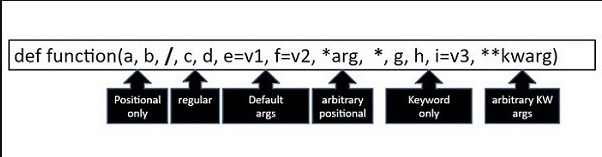
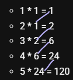

# Python Data Structures, Functions & Core Concepts

## Lists

`pop()` gives an error if not found, but we can handle it gracefully on the index or define what to return if not found.

- `pop()`: Removes the element with the specified index.
- `popitem()`: Removes the last inserted key-value pair (for dictionaries).

> [!WARNING]
> You can't do it with a single `remove()`. `remove()` deletes only the first match. To remove all occurrences, you must loop or use list comprehension.

Here’s both ways ⚡:

**Loop way**  

```python
lst = [1, 2, 1, 3]
while 1 in lst:
    lst.remove(1)
```

**List comprehension way**  

```python
lst = [x for x in lst if x != 1]
```

Also we can do this with `filter()`:

```python
lst = list(filter(lambda x: x != 1, lst))
```

### Sorting Lists

- **Ascending Order**:

```python
numbers: list[int] = [3, 1, 4, 1, 5, 9]  # Unsorted list
numbers.sort()
```

- **Descending Order**:

```python
numbers.sort(reverse=True)
# Or
numbers.reverse()
```

- **String Length (Shortest First)**:

```python
words.sort(key=len)
```

- **String Length (Longest First)**:

```python
words.sort(key=lambda word: len(word))
```

### Using List Comprehension

List comprehension is a powerful feature in Python that allows you to create new lists in a concise way. It's a compact way to create lists from existing lists or other iterables by applying a transformation or filter to each element.

**Syntax**:

```python
new_list = [expression for element in iterable if condition]  # (if condition is optional)
```

Python options to store collections of data:
1. **Tuple**
2. **Set**
3. **List**
4. **Dictionary**

---

## Tuples

- **Hashable**: Tuples can be used as keys in dictionaries because they are immutable.
- 👑 **Allow Duplicate**: Tuples allow duplicate values.

Even though tuples are immutable, Python may create new instances in memory when you define identical tuples in separate assignments. This is why `id(tuple_1)` and `id(tuple_2)` may differ.

```text
id(tuple_1) = 139975700916672
id(tuple_2) = 139975700971648
tuple_1 == tuple_2 = True
```

### Working Methods on Tuples

We can't modify a tuple directly, but we can create a new tuple with the modification:

```python
# Tuple slicing
print("tuple2[1:] =", tuple2[1:])  # Slicing from index 1
treter = tuple2[1:]  # tuple2[1:] = (20, 30)
print("🎈", treter, type(treter))  # 🎈 (20, 30) <class 'tuple'>
```

Also: **`tuple + tuple = tuple`**

```python
# Using dir() without "__" only gives 2 methods:
# 1. 'count'
# 2. 'index'

tuple3: tuple = tuple1 + tuple2 
print("tuple1 + tuple2 =", tuple3)  # ('apple', 'banana', 'cherry', 10, 20, 30)
```

**Tuple nesting is different from tuple concatenation:**

```python
# Nested tuples
nested_tuple = (tuple1, tuple2)
print("nested_tuple =", nested_tuple)  # (('apple', 'banana', 'cherry'), (10, 20, 30))
# Means 2 tuples (), () inside a tuple () ==> ((), ())
```

**Repeating tuples:**

```python
tuple4: tuple = tuple2 * 2
print("tuple2 * 2 =", tuple4)
```

**Unpacking tuples:**

```python
a, b, c = tuple1
print("Unpacking tuple1:", a, b, c)

# Using tuples as keys in dictionaries (because they are immutable)
my_dict = {tuple1: "This is a tuple key", tuple2: "Another tuple key"}
print("Dictionary with tuple keys:", my_dict)
```

### Forbidden Methods on Tuples

```python
# The following methods are NOT supported on tuples:
# tuple1.sort()
# tuple1.reverse()
# tuple1.append("mango")
# tuple1.extend(["grape", "kiwi"])
# tuple1.remove("banana")
# deleted = tuple1.pop(1)
```

To create a tuple with only one item, you have to add a comma after the item; otherwise, Python will not recognize it as a tuple:

```python
thistuple = ("apple",)
print(type(thistuple))  # <class 'tuple'>

# NOT a tuple:
thistuple = ("apple")
print(type(thistuple))  # <class 'str'>
```

It is also possible to use the `tuple()` constructor to make a tuple:

```python
thistuple = tuple(("apple", "banana", "cherry"))  # Note the double round-brackets
print(thistuple)
```

---

## Dictionaries

- **Unindexed**: Items are accessed using keys, not indices.
- **Unique keys**: Keys must be unique, but values can be duplicated.
- **Way to access**: `car["model"]` (no dot notation).
- Alternatively, use `.get()` method:

```python
car = {
    "brand": "Ford",
    "model": "Mustang",
    "year": 1964
}
print(car.get("model"))
```

**Way to add new key/value pair or modify existing key**:

```python
person["email"] = "alice@example.com"
```

Use `dict()` constructor:

```python
thisdict = dict(name="John", age=36, country="Norway")
print(thisdict)
```

The `.items()` method returns each item in a dictionary as tuples in a list:

```python
x = thisdict.items()  # dict_items([('brand', 'Ford'), ('model', 'Mustang'), ('year', 1964)])
```

### `fromkeys()`

**Syntax**: `dict.fromkeys(keys, value)`

- `keys`: Required. An iterable specifying the keys of the new dictionary.
- `value`: Optional. The value for all keys (default is `None`).

```python
x = ('key1', 'key2', 'key3')
y = 0
thisdict = dict.fromkeys(x, y)
print(thisdict)  # {'key1': 0, 'key2': 0, 'key3': 0}
```

### Dictionary Comprehension Syntax

```python
{key: value for item in iterable}
```

```python
celsius_temps = [0, 10, 20, 30, 40]
fr = {str(r) + "c": str((r * 9/5) + 32) + "f" for r in celsius_temps}
```

---

## Sets

A set is:
- Unordered
- Unindexed
- Mutable
- Unique 🌟

> Note: To create an empty set, you must use `set()`, not `{}`.

Can create using `set()` constructor:

```python
my_set2: set = set([123, 452, 5, 6])
```

- ✔ A set can store only immutable objects such as numbers (`int`, `float`, `complex`, `bool`), `string`, or `tuple`.
- ❌ If you try to put a list or dictionary in a set, Python raises a `TypeError` (`unhashable type: 'list'`).

> "Python sets are unordered collections; the way elements are stored in memory depends on hashing, which can lead to unpredictable ordering."

Since sets are unordered, we cannot access them by index, nor do they support item assignment (`my_set[0] = 10`).

```python
my_set: set = {1, 2, 3, 4, 5, 'A', 'a'} 

# Remove an item
my_set.remove(3)  # Output: {1, 2, 4, 5, 'A', 'a'}
my_set.remove('A')  # Output: {1, 2, 4, 5, 'a'}
my_set.add(6)  # Output: {1, 2, 4, 5, 6}
# discard() only removes a single element otherwise accepted 1 arg but got 3
```

To take the union of two sets, use `.union()` or the `|` operator:

```python
my_set: set = {1, 2, 3, 5}
my_set_2: set = {1, 5, 6, 7}
my_set3: set = my_set.union(my_set_2)
my_set3: set = my_set | my_set_2  # Same output
```

### **remove() vs discard() vs difference_update() vs pop() methods:**

**remove() method:**
The `remove()` method removes the specified item from the set.
If the item is not found in the set, it raises a `KeyError`.
This method is suitable when you are sure that the item exists in the set.

**discard() method:**
The `discard()` method also removes the specified item from the set.
However, if the item is not found in the set, it does not raise any error. It simply does nothing.
This method is suitable when you are not sure if the item exists in the set.

**difference_update()** to remove multiple items at once:

```python
my_set: set = {1, 2, 3, 4, 5, 'A', 'a'}
print("Before: my_set = ", my_set)
my_set.difference_update({1, 5, 3, 'A'})
print("After:  my_set = ", my_set)  # {2, 4, 'a'}
```

**Pop():** removes and returns a random element from the set.

**update():** to add multiple items (unlike `difference_update` which uses `{}`, `update` uses `[]`).

```python
print("Before: ", my_set)  # Before: {1, 2, 3, 4, 5, 6, 'Hello! World'}
# Add multiple items
my_set.update([7, 8, 9, "Hello"])
print(my_set)  # {1, 2, 3, 4, 5, 6, 7, 8, 9, 'Hello', 'Hello! World'}
```

### The Hashing Mechanism

Hashing enables quick searching of objects in memory. Only immutable objects are hashable.

```python
a: str = "Hello! World"
b: str = "Hello! World"

print("id(a) = ", id(a))  # id(a) = 132467750244336
print("id(b) = ", id(b))  # id(b) = 132466877525360
print("hash(a) = ", hash(a))  # hash(a) = 9090330697819382555
print("hash(b) = ", hash(b))  # hash(b) = 9090330697819382555
print("hash(a)      = ", hash(a))  # hash(a)      = 9090330697819382555
print("a.__hash__() = ", a.__hash__())  # __dunder__() output is same here
```

- Even if a set only allows immutable items, the set itself is mutable.
- Dictionary keys must be immutable objects because dictionaries use a hash table to store key-value pairs, and **mutable objects cannot be hashed**.

---

## Frozenset

Unique & unordered, but **hashable & immutable**.

- **Thread safety**: `frozenset` is thread-safe due to immutability.
- **Modification methods**: Does not support `add()`, `remove()`, `clear()`, `pop()`, or `update()`.

```python
my_frozenset: frozenset = frozenset([1, 2, 3, "Hello! World"])
print("my_frozenset = ", my_frozenset)

my_set: set = {1, 2, 3, "Hello! World"}
my_frozenset2: frozenset = frozenset(my_set)
print("my_frozenset2 = ", my_frozenset2)
```

---

## Garbage Collection

Python automatically frees up memory occupied by objects that are no longer referenced, preventing memory leaks.

```python
import gc

gc.collect()
print(gc.get_count())  # Prints count of collected, unreachable objects & reference cycles
```

---

## Modules

1. **Built-in**
2. **User-defined (custom)**
3. **External**

| Import Style | Bytecode Impact | Readability | Performance |
| --- | --- | --- | --- |
| `import module` | ✅ Minimal | ✅ Clear | ✅ Fast |
| `from module import *` | ❌ Bigger | ❌ Confusing | ❌ Slower |
| `from math import pi` | ✅ Lean & Clear | ✅ Clear | ✅ Efficient |

**Precedence with wildcards (`from module import *`)**:

```python
from math import *
from numpy import *
print(pi)  # numpy.pi takes precedence because it was imported last
```

---

## Functions (`def`)

A Python function is a block of organized, reusable code used to perform a single, related action.

### Global Scope

Defining a function at the top level of a module gives it module-level scope. Adding the `global` keyword inside a function makes a local variable global.

### Types of Python Functions

1. **Built-in Functions**: `print()`, `len()`, `sum()`, etc.
2. **Functions in Built-in Modules**: Required to be imported (`import random`).
3. **User-defined Functions**:

```python
def my_function():
    print("Welcome to Operation Badar")

my_function()
```

### Is docstring just for comments?

No — **docstring ≠ comment.**

- **Docstring**: Special string for documentation, read by tools (`help()`, IDEs, Sphinx, etc.).
- **Comment (`#`)**: For devs only, not shown by `help()`.

Use docstring if you want your func to be self-documented. It is used for documentation, accessible via `help(add)`.

**Syntax**:
```python
def function_name(parameters):
    """function_docstring"""
    # function_suite
    return expression
```

- **function suite** = the block of code inside the function. `return` is part of the suite.
- **return expression** = the value or calculation that a function returns when called.
- To give return type use `-> return_type:` after parameters.

- **Function expression** = assigning a function to a variable.

```python
add = lambda a, b: a + b
```

#### Function Expressions vs. Function Statements

| Feature | Function Statement (`def`) | Function Expression (`lambda`) |
| --- | --- | --- |
| **Syntax** | `def function_name(parameters): body` | `lambda parameters: expression` |
| **Name** | Requires a name | Anonymous (no name) |
| **Body** | Can contain multiple statements | Limited to a single expression |
| **Use Cases** | General-purpose functions | Short, simple operations, often used with higher-order functions |
| **Return Value** | Explicit return statement or implicit return `None` | Implicit return of the expression's value |

```python
def greetings():
    """This is docstring of greetings function"""
    greet = 'Hello World!'
    return greet

message = greetings()
print(message)
```

### Pass by Reference vs Pass by Value

```python
# Immutable example
def change_num(x):
    x = x + 1
    print("Inside:", x)

a = 5
change_num(a)
print("Outside:", a)
```

**Output**:
```text
Inside: 6
Outside: 5
```

`a` didn't change outside — **immutable**.

---

```python
# Mutable example
def change_list(lst):
    lst.append(4)
    print("Inside:", lst)

b = [1, 2, 3]
change_list(b)
print("Outside:", b)
```

**Output**:
```text
Inside: [1, 2, 3, 4]
Outside: [1, 2, 3, 4]
```

`b` changed outside — **mutable**.

---

- **`change_num`**: Pass by reference, but `int` is immutable, so it acts like pass by value (no real change outside).
- **`change_list`**: Pass by reference, `list` is mutable, so it really changes outside.

In Python:
- Everything (even `int`, `str`) is passed by **object reference**.
- But if the object is **immutable** (`int`, `str`, `tuple`), you can't change it — it looks like pass by value.
- If **mutable** (`list`, `dict`), you can change it — real pass by reference behavior.

👉 **Real rule**: Python always passes references to objects. Whether you can modify the object depends on if it's mutable or immutable.

### Keyword Arguments

We can change the order while calling or skip any if we want, because the Python interpreter can match the provided keyword with parameter:

```python
def printinfo(name, age):
    """This prints a passed info into this function"""
    print("Name: ", name)
    print("Age ", age)
    return

# Now you can call printinfo function
printinfo(age=50, name="Arif")
# printinfo(50, "Arif")
```

### Iterable Unpacking (`*`)

In Python, the `*` operator is used for unpacking iterables (like lists, tuples, or sets) into individual elements. When you use `*` before a list (or any iterable) in a function call, it unpacks the list and passes its elements as separate positional arguments to the function.

- Unpacking (`*something`) → doesn't always output a tuple.
- But in `def func(*args)`, the packed result is always a tuple.

```python
def add(*nums):
    return sum(nums)

print(add(1, 2, 3))  # 6
```

Or:

```python
def my_sum(*nums):
    print(type(nums), ", ", nums)
    return sum(nums)

print("Sum     = ", my_sum(1, 2, 3, 4, 5, 8, 5))
print("Sum *[] = ", my_sum(*[1, 2, 3, 4, 5, 8, 5]))  # * unpacking list
print("Sum *() = ", my_sum(*(1, 2, 3, 4, 5, 8, 5)))  # * unpacking tuple
```

### Positional-Only Arguments (`/`)

Function parameters that must be passed in the same order as defined, without using parameter names (no keyword arguments).

```python
def func(a, b, /, c, d):
    pass
```

- `a` and `b` → **positional-only**
- `c` and `d` → can be **positional or keyword**

#### Example

```python
def greet(name, /):
    print(f"Hello, {name}!")

greet("Alice")     # ✅
greet(name="Bob")  # ❌ TypeError
```

#### Why use it?
- Enforce API clarity
- Match behavior of some C functions
- Prevent misuse of keyword args

### Keyword-Only Arguments (`*`)

Must be passed with their names, otherwise Python raises an error:

```python
def posFun(*, num1, num2, num3):
    print(num1 * num2 * num3)

print("Evaluating keyword-only arguments: ")
posFun(num1=6, num2=8, num3=5)
posFun(num3=6, num1=8, num2=5)

# TypeError: posFun() takes 0 positional arguments but 3 were given
# posFun(6, 8, 5)
```

### Arbitrary / Variable-Length Arguments

Let you pass any number of values:

1. **`*args`** → non-keyword (captured as a `tuple`)
   ```python
   def add(*nums):
       return sum(nums)

   print(add(1, 2, 3))  # 6
   ```

2. **`**kwargs`** → keyworded (captured as a `dict`)
   ```python
   def show(**info):
       print(info)

   show(name="Alice", age=30)  # {'name': 'Alice', 'age': 30}
   ```

---

#### TypeScript / JS Equivalent:

1. **Rest parameters**:
   ```ts
   function add(...nums: number[]) {
     return nums.reduce((a, b) => a + b, 0);
   }

   add(1, 2, 3); // 6
   ```

2. **Object for keyword-like args**:
   ```ts
   function show(info: { [key: string]: any }) {
     console.log(info);
   }

   show({ name: "Alice", age: 30 });
   ```

---

| Syntax | Usage |
| --- | --- |
| `*args` / `**kwargs` | ✅ Only while **creating** a function |
| `*list` / `**dict` | ✅ Only while **calling** a function |

---

### Anonymous Functions (`lambda`)

An anonymous function is a function not declared using the standard `def` keyword.

**Syntax**:
```python
add_numbers = lambda arg1, arg2: arg1 + arg2
result = add_numbers(1, 2)
print(result)  # 3
```

- Lambda functions cannot contain statements like `print`, `if`, `for`, or `while`.

| Feature | Python (`lambda`) | JavaScript/TypeScript (`=>`) |
| --- | --- | --- |
| **Syntax** | `lambda args: expression` | `(args) => expression` |
| **Multi-line?** | ❌ (One-liner only) | ✅ (Supports blocks `{}`) |
| **Scope** | No `return`, only expressions | Supports `{}` with `return` |

### `help()` Function

```python
def add(a, b):
    """Adds two numbers."""
    return a + b

help(add)
```

Running `help(add)` prints the docstring:

```text
Help on function add:

add(a, b)
    Adds two numbers.
```

---

## Generator Functions

A generator function is defined like a normal function but uses the `yield` keyword instead of `return` (though `return` can also be used).

> A **generator** is like a media player:
> - `yield` = ▶️ Pause here & give this value
> - `next()` = ⏯️ Resume from pause  
> - `return` = 🔌 Power off the player  
> - `StopIteration` = End of playlist (no more `next`)

---

### Normal Function (returns all at once)

```python
def get_nums():
    return [1, 2, 3]

print(get_nums())  # [1, 2, 3]
```

---

### Generator Function (yields one by one)

```python
def get_nums():
    yield 1
    yield 2
    yield 3

g = get_nums()
print(next(g))  # 1
print(next(g))  # 2
```

- Creates a **generator object**
- **Lazy evaluation** (saves memory)
- Use `next()` to step through

---

### Key Generator Concepts

| Keyword | Meaning | Analogy |
| --- | --- | --- |
| `yield` | Pause & return a value | ▶️ Pause & play |
| `next()` | Resume from last `yield` | ⏯️ Resume playing |
| `return` | Stop generator, end iteration | 🔌 Power off |
| `StopIteration error` | If no iteration left | 🔺 Battery end |

---

### Generator Expressions / Comprehensions

Generator expressions are a concise way to create generators. They are similar to list comprehensions but use parentheses instead of square brackets:

```python
# Create a generator expression that multiplies each number by 2
gen = (x * 2 for x in range(3))

# Print the type of 'gen', it will show it's a generator
print(type(gen))

# Iterate over the generator
for value in gen:
    print(value)
```

---

## Multi-Type Return in Python

Python functions can return **multiple values** of different types by returning a **tuple**, **list**, **dict**, or custom object. It puts all values into a tuple before returning:

```python
def get_data() -> tuple[int, list[str], dict[str, int]]:
    return 200, ["ok"], {"count": 1}

print(get_data(), type(get_data()))  # (200, ['ok'], {'count': 1}) <class 'tuple'>
```

### Order of Arguments in Function



---

## Python Name Resolution (LEGB Rule)

Python looks up variable names in this order:

- **L** → Local (inside current function)
- **E** → Enclosing (outer function in nested functions)
- **G** → Global (module level)
- **B** → Built-in (e.g., `len`, `sum`)

| Situation | Python Looks Where First | Then... |
| --- | --- | --- |
| Inside a function | Local (L) | Enclosing → Global → Built-in |
| Inside a nested function | Local (L) | Enclosing (E) → Global → Built-in |
| Outside any function | Global (G) | Built-in (B) |

---

- **Fibonacci sequence**: A series of numbers where each number is the sum of the two preceding ones: `0, 1, 1, 2, 3, 5, 8, 13, ...`

---

## Recursion

A **Recursive Function** is a function that calls itself inside its own body. It keeps calling itself until a base case is reached.

### Key Components of a Recursive Function:

- **Base Case**: The condition that stops the recursion.
- **Recursive Case**: The part of the function where it calls itself with a modified input.

#### Example: Factorial of a Number

The **factorial of a number** $n$ (denoted as $n!$) is the product of all positive integers from 1 to $n$. It can be defined recursively as:

- $n! = n \times (n-1)!$ (Recursive Case)
- $0! = 1$ (Base Case)

```python
def factorial(n):  # Take n from user
    # Base case
    if n == 0:  # Return 1 if n = 0
        return 1
    # Recursive case
    else:  # Otherwise
        return n * factorial(n - 1)

# Example usage
print(factorial(5))  # Output: 120
```



---

## Time Complexity Basics

- **O(1) or Constant Time Complexity**: An algorithm takes the exact same amount of time to execute, regardless of the size of the input. Number of operations needed to run an algorithm remains constant.
